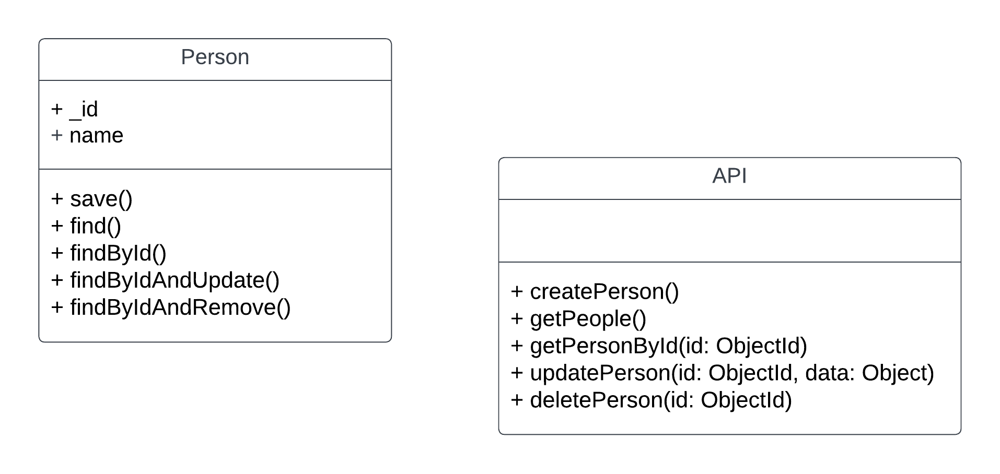

## API Documentation

#### Create a New Person

- **Request**:

  - Method: POST
  - Endpoint: `/api/people`
  - Headers:
    - Content-Type: application/json
  - Body:
    ```json
    {
      "name": "John Doe"
    }
    ```

- **Response**:
  - Status Code: 201 Created
  - Body:
    ```json
    {
      "_id": "some_unique_id",
      "name": "John Doe"
    }
    ```

#### Get People (with optional name filter)

- **Request**:

  - Method: GET
  - Endpoint: `/api/people`
  - Query Parameters (optional):
    - name: String (e.g., "John Doe")

- **Response**:
  - Status Code: 200 OK
  - Body:
    ```json
    [
      {
        "_id": "some_unique_id",
        "name": "John Doe"
      }
      // Other person objects
    ]
    ```

#### Get a Person by ID

- **Request**:

  - Method: GET
  - Endpoint: `/api/people/{person_id}`

- **Response**:
  - Status Code: 200 OK
  - Body:
    ```json
    {
      "_id": "some_unique_id",
      "name": "John Doe"
    }
    ```

#### Update a Person by ID

- **Request**:

  - Method: PUT
  - Endpoint: `/api/people/{person_id}`
  - Headers:
    - Content-Type: application/json
  - Body:
    ```json
    {
      "name": "Updated Name"
    }
    ```

- **Response**:
  - Status Code: 200 OK
  - Body:
    ```json
    {
      "_id": "some_unique_id",
      "name": "Updated Name"
    }
    ```

#### Delete a Person by ID

- **Request**:

  - Method: DELETE
  - Endpoint: `/api/people/{person_id}`

- **Response**:
  - Status Code: 200 OK
  - Body:
    ```json
    {
      "_id": "some_unique_id",
      "name": "John Doe"
    }
    ```

### Sample Usage

#### Create a New Person

```http
POST /api/people
Content-Type: application/json

{
  "name": "John Doe",
}
```

#### Get People (with name filter)

```http
GET /api/people?name=John Doe
```

#### Get a Person by ID

```http
GET /api/people/{person_id}
```

#### Update a Person by ID

```http
PUT /api/people/{person_id}
Content-Type: application/json

{
  "name": "Updated Name",
}
```

#### Delete a Person by ID

```http
DELETE /api/people/{person_id}
```

### Limitations and Assumptions

- The API assumes that the "name" field is a string and enforces this validation.

### Setup and Deployment

To set up and deploy the API, follow these steps:

#### Local Development

1. Clone the GitHub repository:

   ```bash
   git clone https://github.com/your-username/your-repo.git
   ```

2. Navigate to the project directory:

   ```bash
   cd your-repo
   ```

3. Install dependencies:

   ```bash
   npm install
   ```

4. Start the API locally:

   ```bash
   node app.js
   ```

5. Access the API at `http://localhost:3000`.

### Testing

To test the api run `npm run test`


### UML Diagram (Optional)

